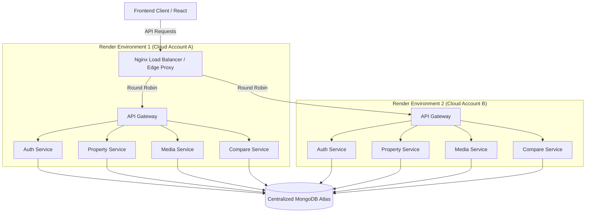

# Apna Ghar - Microservices Project Interview Preparation

## 1. System Architecture Diagram

## 2. General Architecture Questions

**Q1: Can you explain the overall architecture of your Apna Ghar project?**
**Answer:** Apna Ghar is a real estate platform built on a distributed microservices architecture. The frontend is developed in React (with TypeScript). All client requests hit a centralized Nginx Edge Proxy, which acts as a load balancer. Traffic is distributed via a Round-Robin algorithm between two independent Render cloud environments. Each environment hosts an API Gateway that routes requests to specific microservices (Auth, Property, Media, Compare). All microservices are stateless and connect to a single, centralized MongoDB Atlas database cluster.

**Q2: Why did you choose a Microservices architecture over a Monolith?**
**Answer:** Microservices allow independent scaling and deployment. For example, if the `property-service` receives high traffic due to users searching for homes, it can be scaled independently of the `auth-service`. It also isolated failures—if the `compare-service` crashes, users can still log in and view properties. It allowed me to organize the code into distinct domains.

**Q3: What is the role of the API Gateway in your project?**
**Answer:** The API Gateway acts as a single entry point for all frontend requests within a specific cloud environment. It handles request routing to the appropriate underlying microservice based on the URL path (e.g., `/api/auth` goes to Auth Service, `/api/property` goes to Property Service). This prevents the frontend from needing to know the individual URLs of every microservice.

## 3. High Availability and Load Balancing

**Q4: I see you have deployed to two separate Render accounts. Why?**
**Answer:** I implemented this for High Availability (HA) and fault tolerance. By mirroring the entire stack across two separate cloud accounts, the system can survive an outage in one account. It also distributes the load, increasing the overall Requests Per Second (RPS) the platform can handle.

**Q5: How does Nginx fit into this multi-cloud deployment?**
**Answer:** Nginx acts as the global edge proxy and load balancer. It intercepts all incoming API traffic from the frontend and distributes it evenly between the API Gateway of Render Account 1 and Render Account 2. I configured it using a round-robin algorithm, meaning request 1 goes to env 1, request 2 goes to env 2, and so on.

**Q6: What happens to Nginx if the local machine hosting it shuts down?**
**Answer:** If Nginx is hosted locally, it will cease operation upon system shutdown, breaking the application's connectivity. In a true production environment, Nginx itself must be deployed on a highly available cloud server (like AWS EC2, DigitalOcean, or Render) so that it remains continuously available.

## 4. Authentication and State Management

**Q7: How did you implement user authentication and persistent sessions?**
**Answer:** I used token-based authentication (JWT - JSON Web Tokens). When a user logs in via the `auth-service`, a token is generated and returned to the client. The frontend stores this token (usually in `localStorage` or HttpOnly cookies) to persist the session, preventing redundant login prompts. This token is passed in the Authorization header for subsequent protected requests.

**Q8: If your microservices are load-balanced across two environments, how do you handle session state?**
**Answer:** Because I use stateless JWTs, session state is not stored on the server memory. The token itself contains the user's identity and is cryptographically verified by whichever `auth-service` instance receives the request. This statelessness is crucial for load-balanced environments.

## 5. Database and Scalability

**Q9: Both of your Render environments connect to the same MongoDB Atlas database. What are the potential bottlenecks here?**
**Answer:** The primary bottleneck is the database connection pool limits and IOPS (Input/Output Operations Per Second) on the MongoDB Atlas cluster. Since every microservice instance in both environments opens its own connection pool to the database, a sudden spike in instances can exhaust the database's connection limits. 

**Q10: How would you solve this database bottleneck as you scale further?**
**Answer:** I would implement connection pooling best practices (limiting pool size per instance). For massive scale, I would introduce caching layers like Redis for frequently accessed data (like popular property listings) to reduce direct database hits.

## 6. Specific Service Questions

**Q11: Explain the Compare Service you built.**
**Answer:** The Compare Service is a dedicated microservice that allows users to select multiple properties on the frontend and view them side-by-side. The frontend uses `localStorage` to manage the list of selected property IDs, and then sends these IDs to the Compare Service via the API Gateway to fetch and format the relevant data.

**Q12: How are you managing environment variables across these distributed services?**
**Answer:** I use `.env` files for local development. For production on Render, I synchronized the environment variables (like `MONGO_URI`, `JWT_SECRET`, etc.) across both accounts via the Render dashboard to ensure identical behavior. The `PROPERTY_URL` and other service URLs in the API Gateway are dynamically configured to point to their respective environment's internal service URLs.
