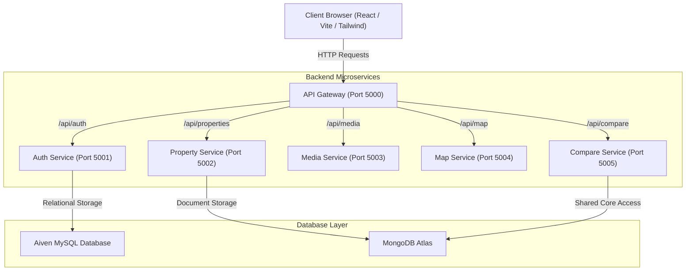

# Apna Ghar Project Architecture & Analysis Report

## 1. Executive Summary
**Apna Ghar** is a feature-rich, high-performance real estate portal built with a modern **React + Vite + Tailwind CSS** frontend and a robust **Node.js microservices architecture** routed through an Express API Gateway. 

The platform supports property listings, authenticated workflows, advanced filtering, multimedia streaming, geographical exploration via maps, and an enterprise-grade side-by-side **Property Comparison Matrix**.

---

## 2. Full-Stack System Architecture

### Microservices Breakdown
| Service Name | Port | Database / Storage | Key Responsibility / Functions |
| :--- | :--- | :--- | :--- |
| **API Gateway** | `5000` | N/A | Central entry point; implements `http-proxy-middleware` and CORS management. |
| **Auth Service** | `5001` | MySQL (Aiven) | Handles user authentication, registration, roles (`buyer`/`seller`/`admin`), and token verification. |
| **Property Service** | `5002` | MongoDB | Core listing database operations, CRUD functions, advanced search/filtering queries. |
| **Media Service** | `5003` | Local/Cloud | Handles uploads, media streaming, and rich image preview assets. |
| **Map Service** | `5004` | GeoJSON / Third-party | Provides spatial context, local maps, and marker exploration functions. |
| **Compare Service** | `5005` | MongoDB | Aggregates property specifications, parses JSON image arrays, computes highlights (cheapest, largest, highest AI score). |

---

## 3. Frontend Technology Stack & Structure
The client application follows enterprise design standards with clean componentization, robust state sharing, and dynamic UI elements:
* **Core Framework:** React 18 + Vite + TypeScript.
* **Routing & Client Cache:** React Router v6 paired with TanStack Query (`@tanstack/react-query`) for efficient data fetching and caching.
* **Design & Styling:** Custom CSS utility integrations (`index.css`), Tailwind CSS v3.4, and Radix UI / Shadcn UI components.
* **Mapping Components:** Powered by Leaflet / React-Leaflet.
* **Context Providers:** 
  * `AuthProvider`: Manages application user session tokens and details.
  * `CompareProvider`: Manages shared state/localStorage for shortlisted property comparison identifiers.

---

## 4. Deep-Dive: Property Comparison Subsystem

### Architectural Flow
1. Users browse listing cards on the frontend and trigger the **Compare** action.
2. The `CompareContext` syncs the target identifiers to local persistence.
3. Upon loading `/compare` (`CompareProperties.tsx`), a bulk query payload containing `propertyIds` is sent to the `/api/compare/matrix` backend endpoint.
4. The service fetches the database schemas, aggregates records, normalizes legacy fields, and computes real-time evaluations:
   * **Financial Evaluation:** Highlights the absolute best-priced property.
   * **Super Built-up Area:** Detects and flags the listing with the largest internal area.
   * **AI Valuation Accuracy:** Evaluates listing completeness to render an automated dynamic heuristic score.
5. The frontend implements graceful client-side fallbacks using internal offline datasets (`seedProperties`) if backend connectivity interrupts.

---

## 5. Architectural Strengths & Recommendations

> [!TIP]
> **Performance Optimization**
> Currently, the microservices execute via concurrent `nodemon` instances during local testing. For production deployments, configuring containerized orchestration using **Docker Compose** will improve isolated consistency and minimize local environment port conflicts.

> [!IMPORTANT]
> **Database Resilience**
> The platform adopts a polyglot persistence strategy using both relational (MySQL) and document-oriented (MongoDB) solutions. It is highly recommended to introduce a dedicated message queue (e.g., RabbitMQ or Redis Streams) if asynchronous event sync becomes necessary between authentication registration events and profile configurations.

> [!NOTE]
> **Gateway Resilience**
> The `CompareProperties.tsx` component safely tests both custom hosted URLs (`apnaghar-gateway.onrender.com`) and local fallbacks. Ensuring production gateway configurations implement robust rate-limiting and connection-pool timeouts will preserve backend health under heavy concurrent analytical queries.
